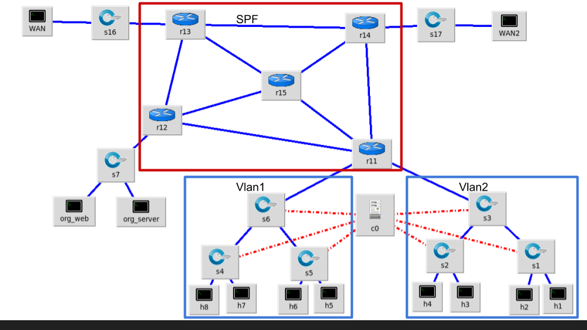

2018 Fall Computer Network Final Project
========================================

DDoS attack mitigation mechanism implementation

Requirement
-----------

- Assignment 1: Mininet & OpenFlow controller installation
- Assignment 2: VLAN configuration
- Assignment 3: SPF route configuration
- Final project: based on the previous assignments, design and implement a virtualized network function (VNF)

For example, resource allocation, QoS routing, etc

Topology
--------



Scenario
--------

- All host in VLAN can access WAN and organization network through SPF route.
- Some host triggered the traffic limit that configured by c0 controller.
- Controller tells switch to drop the traffic from the host in their VLAN.
- Other host can access WAN and organization network as usual.

How to get started
------------------

Miniedit - a simple GUI editor for Mininet

```
$ sudo ~/mininet/examples/miniedit.py
```

TODO
----

- VLAN configuration
  * https://github.com/mininet/mininet/blob/master/examples/vlanhost.py
- SPF route configuration
  * https://github.com/wangdongxuking61/ryu/tree/master/shortest_path_app
- controller behavior implement

References
----------

- C. J. Fung and B. McCormick, "VGuard: A distributed denial of service attack mitigation method using network function virtualization," 2015 11th International Conference on Network and Service Management (CNSM), Barcelona, 2015, pp. 64-70.
- L. Zhou and H. Guo, "Applying NFV/SDN in mitigating DDoS attacks," TENCON 2017 - 2017 IEEE Region 10 Conference, Penang, 2017, pp. 2061-2066.
- Jakaria, A. H. M., et al. "Dynamic DDoS defense resource allocation using network function virtualization." Proceedings of the ACM International Workshop on Security in Software Defined Networks & Network Function Virtualization. ACM, 2017.
